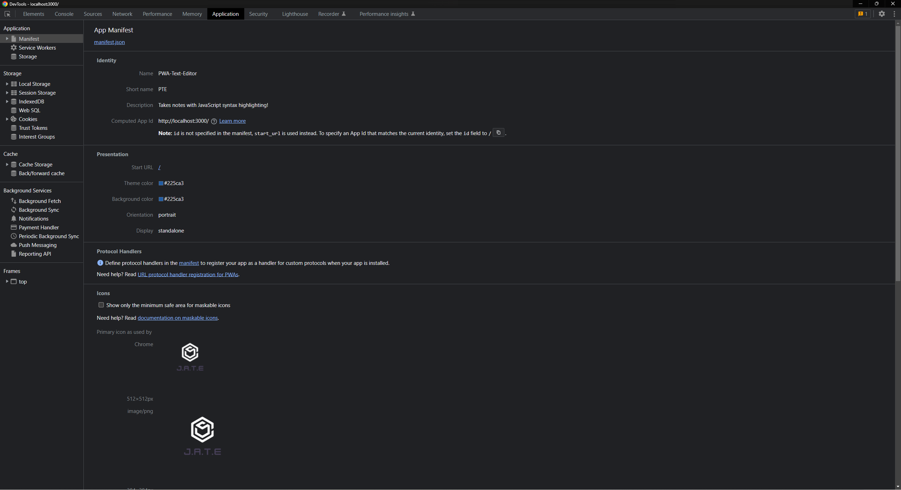
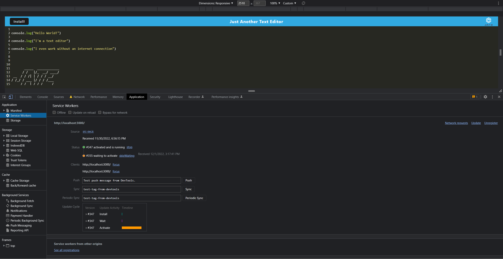

# PWA-Text-Editor

## Description

A JavaScript text editor that runs in the browser. This is a single-page application built using PWA criteria. The application features a number of data persistence techniques that serve as redundancy in case one of the options is not supported by the browser. Built from starter files

## Table of Contents

- [Description](#description)
- [Screenshots](#screenshots)
- [Installation](#installation)
- [Usage](#usage)
- [Credits](#credits)
- [License](#license)
- [Contributing](#contributing)
- [Questions](#questions)

## Screenshots

#### Manifest in dev tools.

#### Service worker in dev tools.

## Installation

Clone this repo locally and run npm scripts to install.

## Usage

Use to edit text, the app can be used without connection to the internet and still save your text.

## License

This repository is under the license MIT License.
For more information see https://opensource.org/licenses/MIT

## Contributing

Issue a pull request.

## Questions

Please contact me via the following methods.

- Github: [JCaloca](https://github.com/JCaloca)
